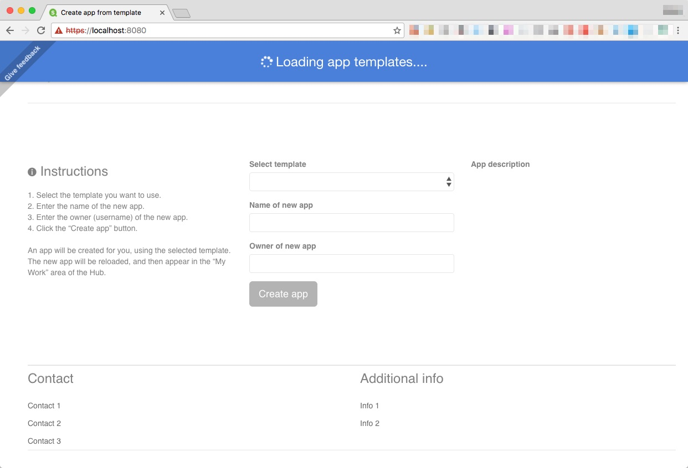
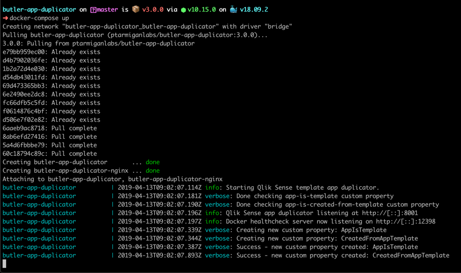
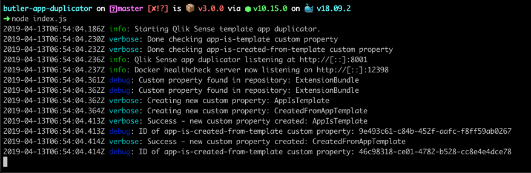

# App duplicator for Qlik Sense

A microservice for handling back-end tasks related to creating new Sense apps, using existing apps as templates.


## What's new

Please see the [change log](https://github.com/ptarmiganlabs/butler-app-duplicator/blob/master/changelog.md) for a comprehensive list of changes.

Highlights in the most recent release are

### v3.0

This is a major update, with most parts of the being refactored to work better and provide new features.

New features include

* Dockerization. Provide everything needed to run the app duplicator as a Docker container, including image files in Docker Hub.
* When run using Docker, the app duplicator will bring up its own web server (based on nginx). No more reliance on external web servers thus.
* Make filelogging optional. The log level used for file logging follows the overall log level that has been configured in the YAML config file.
* https for the app duplicator REST API can be enabled/disabled in the config file. While https is important, it is not always relevant (for example when running behind reverse proxies).
* User configurable name of custom property that will be set for apps created using this tool. This makes it easy to later see what apps were created using the app duplicator, and which were not.
* User configurable name of the custom property used to identify apps as being templates. If the property does not exist, it will be created.

## Why an app duplication service

While perfectly possible to create every Sense app from scratch, Sense developers quickly realise the value of having a library of code snippets, usually in the form of include files that can be brought into the load script by means of $(Must_Include=[lib://path/to/script.qvs]) or similar.

This does go a long way towards reusing important pieces of code, but it also requires that developers remember to include the correct source code files.
It also helps when training new Sense developers - they do not have to learn every detail about every piece of code that is shared across apps - the include files provide a nice layer of abstraction.
  
This app duplicator project started after realising that the above could be improved.

If the term "app duplication" sounds strange to you, think of it as an "app wizard" or "app generator". A tool that creates new apps, simply.

## Benefits of an app duplication service

* **Lowered barrier of entry for new Sense developers**  
Sense app development can be a challenge for people coming from other platforms and languages.  
The script language borrows from other languages, but is at the end of the day unique.
By allowing developers coming to the Sense platform to easily create skeleton apps based on well designed and complete template apps, these people will become productive way quicker than otherwise.  
Their apps will also be of higher quality than if they had to start over from scratch for each app they create.

* **Productivity boost for experienced Sense developers**  
Experienced developers are often faced with similar challenges over and over again.  
Extracting data into a QVD layer is a classic example - these apps often look about the same over and over again.  
Creating a template out of such an app, that template can then be used every time a QVD extractor app is needed.  
Each such app will be structured the same way, do error reporting the same way, use the same variable names etc.    
The new app usually still needs to be customised to the exact task at hand - but in general the result is simply better, more readable code.

* **Better odds of apps aligning with corporate coding standards**  
If there are more than a handful och Sense developers in a company, there is a good chance there are some guidelines on how to structure the load scripts in Sense apps.  
By instantiating new apps from template apps (that follow the coding standards), better code quality will be achieved.

* **Track how apps are created**  
When an app is created using this tool, a custom property is set for the newly created app. This makes it possible to get actual numbers on how many apps are created using the hub (where apps won't have that custome property set) and the app generation tool. This can be useful from a compliance point of view, for example.

## User interface

In its current version, this project consists of two parts: A backend node.js service (also available as a Docker image) that deals with all interactions with the Qlik Sense services, and a user interface (UI) that talks to the app duplicator service.
  
Included in this repo is a basic, but fully functioning UI:

|   |   |
|---|---|
|  |  |
|  |  |
|   |   |

Features include:

* A list of available Sense template apps (these are the apps that have been marked as templates by means of sett ing a specifc custom property, see below).
* An input box where the new app's name can be entered. This field is verified to be at least 3 characters long, to avoid too short and cryptic app names.
* An input box where the new app's owner can be entered. There is input valdidation here too - only usernames including basic characters are allowed.
* A feedback button in upper left corner, providing an easy yet unobtrusive way of providing feedback on the app, asking questions etc.
* When an app has been created, the user is presented with a direct link to the new app. No need to first open the hub, then find the new app, and finally open it. Instead - just click the offered link and the new app will open.

The same basic features could be integrated into a company internal Qlik Sense Developer portal, which could then bring together wikis, links to relevant resources, this app creation tool, data lineage tools etc. This has in fact proven to work well - worth considering thus!

## Requirements, installation & configuration

The app duplicator tool is intended to be used in a Sense Enterprise environment. Using it with Sense Desktop has not been tested at all.

The tool can be run in either of two ways: As a Docker container or as a native Node.js application. The Docker alternative is by for the best and highly recommended.

There must be network connectivity between the server where the app duplicator runs and a server where the Qlik Sense Repository Service runs. 

### General installation

* Copy the `./production_template.yaml` file to a new file called production.yaml in the same directory.
* Edit the `production.yaml` file to meet your specific environment. See below for details.
* [Export certificates](https://help.qlik.com/en-US/sense/February2019/Subsystems/ManagementConsole/Content/Sense_QMC/export-certificates.htm) from Qlik Sense QMC, then place them in the ./config/certificate folder under Butler SOS' main folder.
* If you are planning to use the web UI, review the HTML and Javascript files. For example
	* `./www/src/index.html`: Update feedback link (around line 38). By default it points to the issue creation dialog in this repository, which is probably not what you want
	* `./www/src/js/duplicate-app.js`): Update duplicatorService variable the server where the app duplication service exposes its REST API.
	*  `./www/src/js/duplicate-app.js`): Enter the FQDN or IP of your Sense server (needed for the link to the newly created apps) around line 45.

### Running as a Docker container

The `docker-compose.yml` file will create two containers: `butler-app-duplicator` and `butler-app-duplicator-nginx`. The former is the the service that talks to Qlik Sense and offers a REST API through which app duplication can be performed, while the latter is a bare-bones nginx server used to serve the included web UI.

The docker-compose file should in most cases work out of the box, but is also very flexible if needed. 

General steps to get started with the Docker image:

* Web UI served on port 89 of the Docker host. Defined in the `docker-compose.yml file`.
* App duplication REST API served on port 8001 of the Docker host. Defined in the `docker-compose.yml file`.
* Static web site is stored in `./www/src/`. Edit as needed.
* Config file for the app duplication service is stored in `./config`. See below for details.

Creating and starting the Docker containers might look like this:



### Running as a native Node.js application

* Node.js must be installed. The app duplicator service was developed using Node 10.15.0.

* If the web UI is to be used, some kind of http server (IIS, Apache, Nginx etc) must also be available.
* Download and extract the app duplicator code to a suitable directory on the server.  
***NOTE***: You should not just get the latest source code from the master branch. The master branch might very well be in active development and not do what you expect it to do... The [releases](https://github.com/ptarmiganlabs/butler-app-duplicator/releases) have been tested - those are your best bet.
* Start the service by running "node index.js" from the command prompt.

When starting the service in debug mode you might see something like this:

 


#### Using the web UI

The web UI is basic but fully functional. It can be used as is, or as a starting point for your own customizations.

If you want to try it out you can use [http-server](https://github.com/indexzero/http-server) to serve the web UI. Just install http-server, cd into the www directory and start the http server

```bash
mylaptop:www goran$ http-server
Starting up http-server, serving ./
Available on:
  http://127.0.0.1:8080
  http://192.168.1.132:8080
Hit CTRL-C to stop the server
```

### Configuration file

Make a copy of `./config/production-template.yaml`, rename the new file production.yaml. Edit as needed to match your Qlik Sense Enterprise environment. The parameters in the config file are described below.

All parameters must be defined in the config file - run time errors will occur otherwise.

| Parameter | Description |
| --------- | ----------- |
| logLevel | The level of details in the logs. Possible values are silly, debug, verbose, info, warn, error (in order of decreasing level of detail). |
| fileLogging | true/false to enable/disable logging to disk file |
| logDirectory | Subdirectory where log files are stored |
|  |  |
| clientCertPath | Certificate file. Exported from QMC |
| clientCertKeyPath | Certificate key file. Exported from QMC |
| clientCertCAPaßth | Root certificate for above certificate files. Exported from QMC |
|  |  |
| httpsEnable | Enable https for the app duplication server (true/false) |
| sslCertPath | SSL certificate used to secure the communication to the duplicate server (if it is enabled). Can be pem or pvk/cer |
| sslCertKeyPath | SSL certificate key used to secure the communication to the duplicate server (if it is enabled). Can be pem or pvk/cer |
|  |  |
| loadScriptURL | URL where newly created apps' load scripts are retrieved from. The URL must be directly accessible from the server where the duplication service runs - no authentication is done |
|  |  |
| host | IP or FQDN of Qlik Sense that the duplication server will connect to |
|  |  |
| customPropertyName | Name of the custom property that will be used to identify apps as being templates. Property will be created if it does not already exist. Use the QMC to set this property to `Yes` for the apps that should be used as templates |
| customPropertyCreatedFromTemplate | Name of custom property that will be used to indicate that an app was created using the app duplication tool |
|  |  |
| senseUserDirectory | Newly created apps will be assigned to specific users. Define what user directory will be used within Qlik Sense
|  |  |
| engineVersion | Qlik Associative Engine version to use with Enigma.js. Possible values [here](https://github.com/qlik-oss/enigma.js/tree/master/schemas) |
|  |  |
| restAPIPort | Port on which the app duplicator's REST API will listen |
|  |  |
| reloadNewApp | Reload app after it has been created (true/false). This setting is used global, i.e. used for all created apps |

The `production.yaml` file can be named anything, as long as it matches the value of the `NODE_ENV` environment variable.  
For example, if the config file is called `production.yaml`, the NODE_ENV environment variable should be set to 'production':

Windows: `set NODE_ENV=production`  
Linux: `export NODE_ENV=production`.  
Docker: Set in the `docker-compose.yml` file

## Define template apps

Before using the app duplicator service, you need to specify what existing apps should be used as templates.
Open the QMC's app section, then set the custom property AppIsTemplate (or whatever it was defined as in the YAML config file) to "Yes" for these apps.  
That's it - no other configuration needed to make a template out of an existing app!

## A note on SSL certificates

While it is preferred to secure the duplication service's REST API with proper https certificates, there are also cases where http will be fine.

For example, if the app duplicator will be hidden behind a reverse proxy (that uses https) you could consider using http for the duplicator service.

## REST API of the app duplicator service

### Retrieve a list of template apps

You can use any tool capable of creating REST calls to test the service, including a simple web browser.  
Standard curl is used below, the assumption is that the command is executed on the same server where the app duplicator service is running, and that the service port is configured to be 8001.

```bash
curl -X GET "https://localhost:8001/getTemplateList"
```

Returns a HTTP 200 response, with a JSON structure such as

```json
[{
    "name": "SQL Server to QVD - TEMPLATE",
    "id": "11111111-2222-3333-4444-555555555555",
    "description": "Template app for mirroring result sets coming from SQL Server to the Sense server, where they are stored locally on disk as QVDs."
}, {
    "name": "Postgres to QVD - TEMPLATE",
    "id": "21111111-2222-3333-4444-555555555555",
    "description": "Template app for mirroring result sets coming from Postgres to the Sense server, where they are stored locally on disk as QVDs."
}, {
    "name": "Skeleton UI app - TEMPLATE",
    "id": "31111111-2222-3333-4444-555555555555",
    "description": "Template app for creating user facing Sense apps. The app loads shared code from include files, including error handling and code for notifying end users when reloads are completed (and new data is available in the app)."
}]
```

### Create a new app based on a template app, replacing the load script of the new app

When creating a new app that should get its load script from the file specified in the config file's loadScriptURL option, use the /duplicateNewScript endpoint.  
The new app will be reloaded (using the new load script) before saved to disk.

```bash
curl -X GET "https://localhost:8001/duplicateNewScript?appName=My%20new%20app&templateAppId=11111111-2222-3333-4444-555555555555&ownerUserId=joe"
```

Returns

```bash
HTTP/1.1 200 OK
Content-Type: application/json
Content-Length: 83
Date: Thu, 05 Jan 2017 22:28:08 GMT
Connection: close

{"result":"Done duplicating app","newAppId":"794e4003-aa89-4a4e-9120-7eb4d6314a32"}
```

I.e. the JSON structure is  

```json
{
    "result": "Done duplicating app",
    "newAppId":"794e4003-aa89-4a4e-9120-7eb4d6314a32"
}
```

#### Query Parameters

```bash
appName: string
templateAppId: string
ownerUserId: string
```

### Create a new app based on a template app, NOT replacing the load script of the new app

When creating a new app that should keep the load script of the template app, use the /duplicateKeepScript endpoint.  
The new app will be reloaded (using the load script from the template app) before saved to disk.

```sh
curl -X GET "https://localhost:8001/duplicateKeepScript?appName=My%20new%20app&templateAppId=11111111-2222-3333-4444-555555555555&ownerUserId=joe"
```

The response from the service is exactly the same as for the /duplicateNewScript endpoint (see above).  

#### Query Parameters

```json
appName: string
templateAppId: string
ownerUserId: string
```

### Tests

The project comes with a bundled npm test suite, built using Mocha, Supertest and Chai.
Start the tests by running

```bash
npm test
```

in the main project directory. This will run the test suite and create a test report like [this one](./test/testresult.md).


