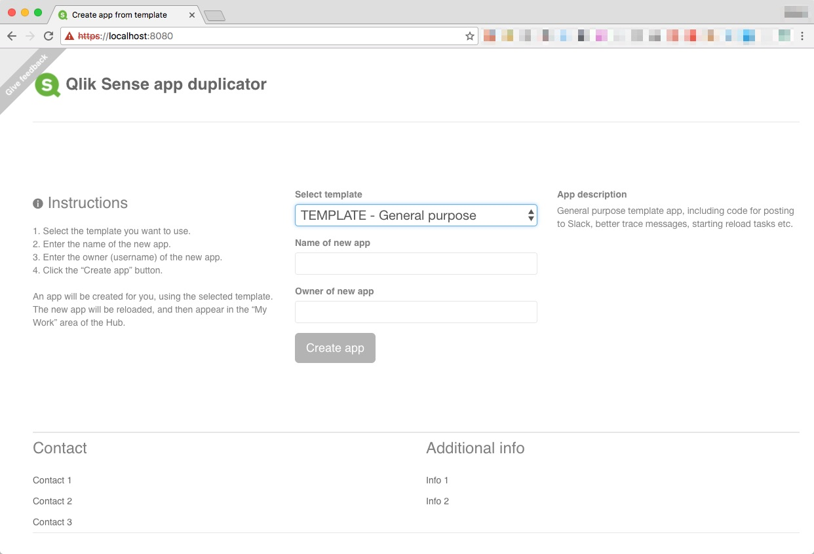
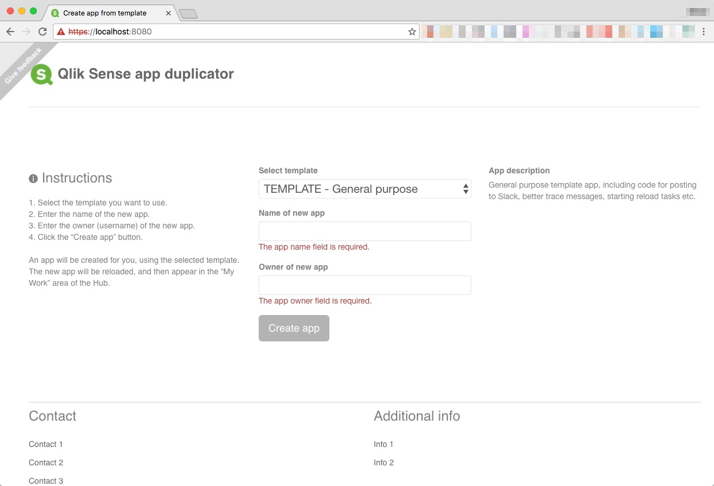
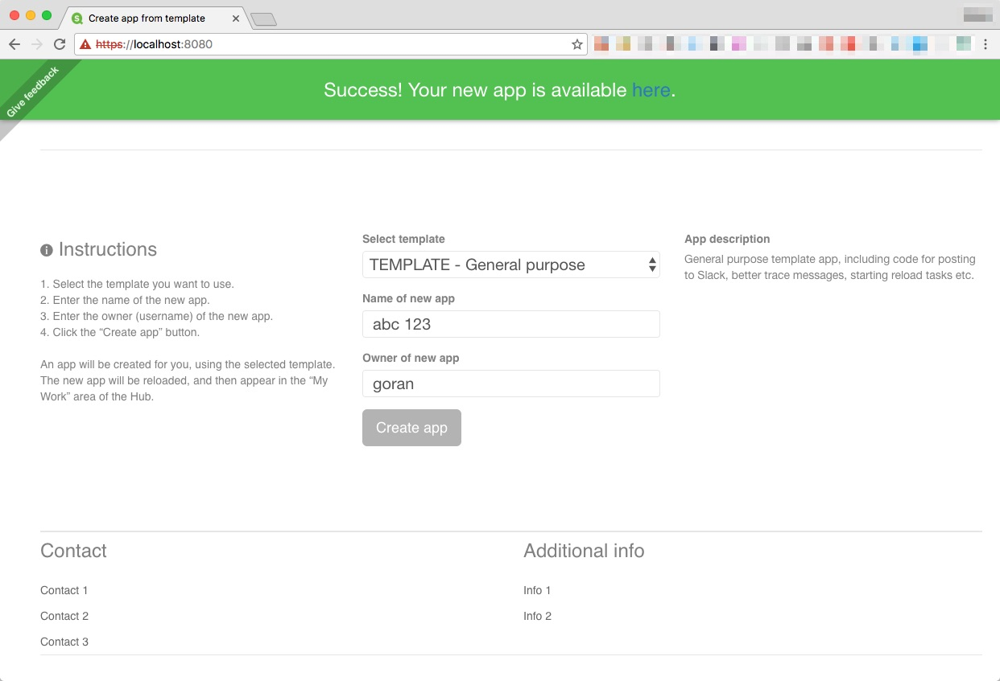

# Qlik Sense app duplicator
[](https://snyk.io/test/github/mountaindude/sense-template-app-duplicate)  
[](https://nodesecurity.io/orgs/ptarmiganlabscom/projects/fd47ee20-3874-4aab-9a6d-c8ac5106f03e)    
  
<BR>


  
<BR>    
  
Node.js server for handling back-end tasks related to creating new Sense apps, using existing apps as templates


## Why an app duplication service?

While perfectly possible to create every Sense app from scratch, Sense developers quickly realise the value of having a library of 
code snippets, usually in the form of include files that can be brought into the load script by means of $(Must_Include=[lib://path/to/script.qvs]) or similar.
This does go a long way towards reusing important pieces of code, but it also requires that developers remember to include the correct source code files.
It also helps when training new Sense developers - they do not have to learn every detail about every piece of code that is shared across apps - the include files provide a nice layer of abstraction.
  
This app duplicator project started after realising that the above could be improved.


## Benefits of an app duplication service

* **Lowered barrier of entry for new Sense developers**  
Sense app development can be a challenge for people coming from other platforms and languages.  
The script language borrows from other languages, but is at the end of the day unique.
By allowing developers coming to the Sense platform to easily create skeleton apps based on well designed and complete template apps, these people will become productive way quicker than otherwise.  
Their apps will also be of higher quality than if they had to start over from scratch for each app they create.

* **Productivity boost for experienced Sense developers**  
Experienced developers are often faced with similar challenges over and over again.  
Extracting data into a QVD layer is a classic example - these apps often look about the same over and over again.  
Creating a template out of such an app, that template can then be used every time a QVD extractor app is needed.  
Each such app will be structured the same way, do error reporting the same way, use the same variable names etc.    
The new app usually still needs to be customised to the exact task at hand - but in general the result is simply better, more readable code.

* **Better odds of apps aligning with corporate coding standards**  
If there are more than a handful och Sense developers in a company, there is a good chance there are some guidelines on how to structure the load scripts in Sense apps.  
By instantiating new apps from template apps (that follow the coding standards), better code quality will be achieved.
  

## User interface
In its current version, this project consists of two parts: A backend node.js service that deals with all interactions with the Qlik Sense services, and a
user interface (UI) that talks to the app duplicator service.
  
Included in this repo is a basic, but fully functioning UI:
    
   

|   |   |
|---|---|
|  |  |
|  |  |
|   |   |


<BR>
<BR>
Features include: 

* A list of available Sense template apps (these are the apps that have been marked as templates by means of the AppIsTemplate custom property, see below).
* An input box where the new app's name can be entered. This field is verified to be at least 3 characters long, to avoid too short and cryptic app names.
* An input box where the new app's owner can be entered. There is input valdidation here too - only usernames including basic characters are allowed.
* A feedback button in upper left corner, providing an easy yet unobtrusive way of providing feedback on the app, asking questions etc. 
* When an app has been created, the user is presented with a direct link to the new app. No need to first open the hub, then find the new app, and finally open it. Instead - just click the offered link and the new app will open.

  
Another interesting option would be to integrate the app duplication concept into alternate Qlik Sense hubs such as Axis' [Simple Hub](http://viz.axisgroup.com/simple-hub/) or [Combined Hub](http://viz.axisgroup.com/combined-hub/)  
(both part of their [RxQAP](https://github.com/axisgroup/RxQAP) library), or [Stefan's Sense custom hub](https://github.com/countnazgul/sense-custom-hub). 
Both could probably be very nicely adapted to work with the duplicator service.  
<BR>
     
   
# Requirements and installation
* The app duplicator service is intended to be used in a Sense Enterprise environment. Using it with Sense Desktop might be possible, but will require modifications of the source code.
* The service can be run on a Sense server, or on some other server. The only condition is that the server where the app duplicator service runs must be able to connect to the Sense servers (of course..).
* Node.js must be installed. The app duplicator service was developed using Node 6.10.0, but has been successfully tested with later Node versions too. At the time of this writing the service runs nicely with Node 8.9.4.
* Download and extract the app duplicator code to a suitable directory on the server.
* Copy the default_config.yaml file to a new file called default.yaml. Place the new file in the "config" directory.
* Edit the default.yaml file to meet your specific environment.
* Start the service by running "node index.js" from the command prompt.
* When new apps are created, the reload script of the template app is either left intact, or replaced with a new script (there are two different REST endpoints for this).  
If the script is replaced, the new script is retrieved from a URL - typically from a revision control system system such as Github.  
* Create a custom property (by using the Sense QMC) called "AppIsTemplate". It should only exist for Apps. Possible values should be "Yes" and "No".
* If you are planning to use the UI, please go through the HTML and Javascript files, making sure to
  * enter the FQDN or IP of your Sense server (needed for the link to the newly created apps).
  * enter a URL for the feedback button to something that is relevant for you. By default it points to the issue creation dialog in this repository, which is probably not what you want in your production environment..  
* As of version 1.1.0, the app duplicator only works using https. *It's a bit more work setting up, but security is important. No shortcuts.*


# Usage
Before using the app duplicator service, you need to specify what existing apps should be considered to be templates.
Open the template apps in the QMC's app section, then set the custom property AppIsTemplate to "Yes" for these apps.  
That's it - no other configuration needed to make a template out of an existing app!

## A note on SSL certificates
All commucation is done using https. This includes both between the UI and the duplicator service, as well as between the duplicator service and Qlik Sense.   
If you use self-signed certificates in the duplicator service, you will probably get warnings when accessing the service.  
A better option is to use a proper certificate. If you don't already have one, it is possible to get free ones from [https://letsencrypt.org/](https://letsencrypt.org/). 


## Retrieve a list of template apps
You can use any tool capable of creating REST calls to test the service, including a simple web browser.  
Standard curl is used below, the assumption is that the command is executed on the same server where the app duplicator service is running, and that the service port is configured to be 8000.


```sh
curl -X GET "https://localhost:8000/getTemplateList"
```

Returns a HTTP 200 response, with a JSON structure such as

```json
[{
    "name": "SQL Server to QVD - TEMPLATE",
    "id": "11111111-2222-3333-4444-555555555555",
    "description": "Template app for mirroring result sets coming from SQL Server to the Sense server, where they are stored locally on disk as QVDs."
}, {
    "name": "Postgres to QVD - TEMPLATE",
    "id": "21111111-2222-3333-4444-555555555555",
    "description": "Template app for mirroring result sets coming from Postgres to the Sense server, where they are stored locally on disk as QVDs."
}, {
    "name": "Skeleton UI app - TEMPLATE",
    "id": "31111111-2222-3333-4444-555555555555",
    "description": "Template app for creating user facing Sense apps. The app loads shared code from include files, including error handling and code for notifying end users when reloads are completed (and new data is available in the app)."
}]
``` 
  
## Create a new app based on a template app, replacing the load script of the new app
When creating a new app that should get its load script from the file specified in the config file's loadScriptURL option, use the /duplicateNewScript endpoint.  
The new app will be reloaded (using the new load script) before saved to disk.
  
```sh
curl -X GET "https://localhost:8000/duplicateNewScript?appName=My%20new%20app&templateAppId=11111111-2222-3333-4444-555555555555&ownerUserId=joe"
```

Returns

```
HTTP/1.1 200 OK
Content-Type: application/json
Content-Length: 83
Date: Thu, 05 Jan 2017 22:28:08 GMT
Connection: close

{"result":"Done duplicating app","newAppId":"794e4003-aa89-4a4e-9120-7eb4d6314a32"}
```

I.e. the JSON structure is  

```json
{
    "result": "Done duplicating app",
    "newAppId":"794e4003-aa89-4a4e-9120-7eb4d6314a32"
}
```


### Query Parameters
```
appName: string
templateAppId: string
ownerUserId: string
```


## Create a new app based on a template app, NOT replacing the load script of the new app
When creating a new app that should keep the load script of the template app, use the /duplicateKeepScript endpoint.  
The new app will be reloaded (using the load script from the template app) before saved to disk.
  


```sh
curl -X GET "https://localhost:8000/duplicateKeepScript?appName=My%20new%20app&templateAppId=11111111-2222-3333-4444-555555555555&ownerUserId=joe"
```

The response from the service is exactly the same as for the /duplicateNewScript endpoint (see above).  


### Query Parameters
```
appName: string
templateAppId: string
ownerUserId: string
```


## Version history
1.2 Changed to YAML config file, updated module dependencies to latest version, added new config options for port and engine version.
